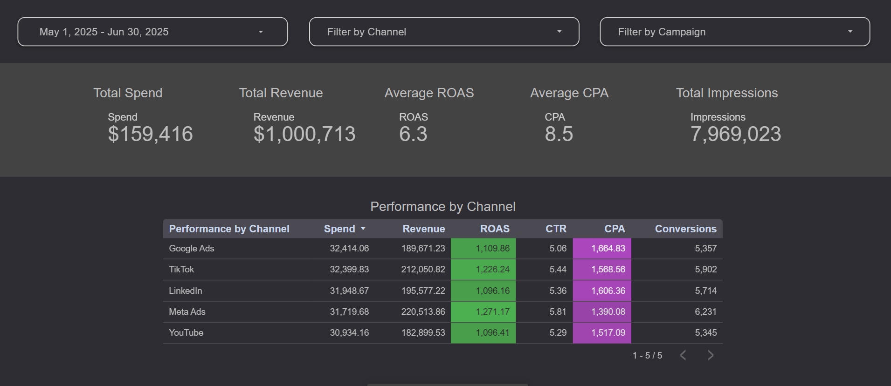

  

# 📊 Media Campaign Optimization Project

A complete data analytics portfolio project simulating a BI/Data Analyst role at a digital media agency. This project takes raw ad campaign data across multiple platforms and transforms it into actionable insights and an interactive dashboard.

---

## 📁 Project Overview

This project simulates key responsibilities from a business intelligence role at a company like AI Digital. It includes:

- Data cleaning and transformation
- Exploratory data analysis
- KPI engineering (ROAS, CPA, CTR)
- Dashboard development with Looker Studio
- Strategic recommendations for optimizing media spend

---

## 🎯 Objectives

- Identify top-performing marketing channels and campaigns
- Build a self-service dashboard with filters and time series analysis
- Apply Python and SQL-style logic for wrangling and analyzing ad data
- Communicate insights visually and in business context

---

## 📦 Dataset

Simulated campaign-level media spend data across 5 platforms:
- Meta Ads
- TikTok
- YouTube
- LinkedIn
- Google Display

Each record includes:
- Campaign info (platform, objective, name)
- Performance metrics (spend, revenue, conversions, clicks, impressions)
- Derived metrics (ROAS, CPA, CTR)

**File Locations:**
- `data/media_campaign_data.csv`
- `data/clean/media_campaign_data_clean.csv`

---

## 🔍 Key Questions

- Which channels generate the highest ROAS?
- Which campaigns are cost-effective or underperforming?
- Is CTR a reliable predictor of revenue efficiency?
- Which platforms offer consistent performance across campaigns?

---

## 🔧 Tools & Technologies

- Python (Pandas, NumPy)
- Jupyter Notebook
- Matplotlib & Seaborn
- Looker Studio
- Excel/CSV
- Git & GitHub

---

## 📈 Key Insights

- **High ROAS Platforms**: Meta Ads and TikTok outperformed others in return on ad spend.
- **Efficient Campaigns**: "Creator Collab" and "Lookalike Expansion" delivered strong results.
- **CTR ≠ ROI**: Correlation between CTR and ROAS is moderate (0.57), not strong enough for sole optimization.
- **Stable Performers**: YouTube and LinkedIn are steady, making them safer for baseline media allocation.

---

## 📊 Dashboard Preview

Built with Looker Studio:

- KPI Summary Row
- Channel Comparison Bar Charts
- Campaign-Level Performance Table
- Time Series of Spend, Revenue, ROAS
- CTR vs ROAS Scatter Plot
- Interactive Filters for Channel, Campaign, and Date

**Dashboard Export:**
- `outputs/lookerstudio_dashboard.pdf`

**Screenshots:**  
See `images/` folder for previews

---

## 📓 Notebook Report

Full step-by-step analysis in Jupyter Notebook:

- Data loading & inspection
- Cleaning & wrangling
- KPI calculation
- Exploratory data analysis
- Correlation analysis
- Strategic recommendation

**Notebook Export:**  
- `notebooks/media_campaign_analysis.ipynb`  
- `outputs/media_campaign_analysis_report.pdf`

---
Created by **Giorgi Dzebisashvili**
